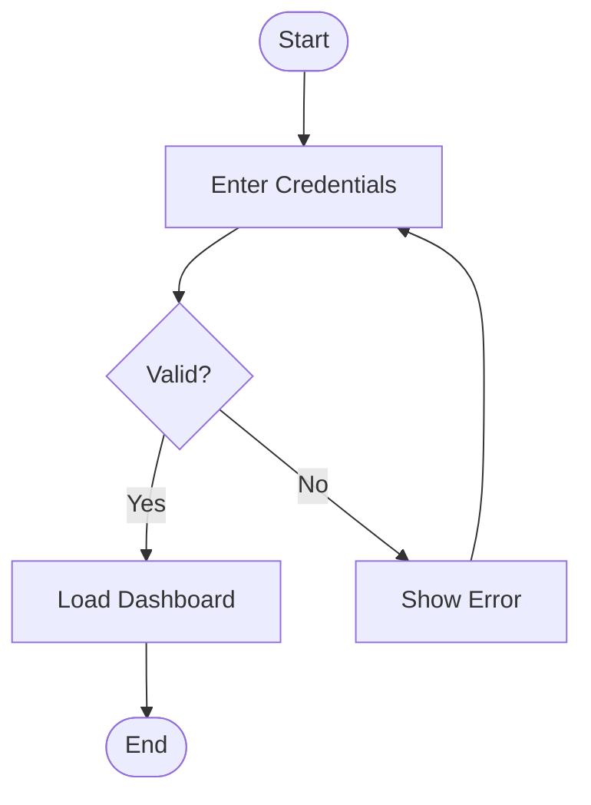

# MermaidFlow Animator

Um visualizador interativo que transforma diagramas escritos em sintaxe **Mermaid** em fluxos animados em tempo real. As caixas viram nós com formas, as setas viram **canos** estilo encanamento, e pequenas **partículas** atravessam esses canos representando dados em movimento — como pacotes em uma rede ou requisições em um sistema.

A aplicação roda 100% no navegador. Sem backend, sem banco, sem telemetria.

---

## Demo

GIF gerado pela própria aplicação no botão **EXPORT GIF** — diagrama Login Flow com partículas de **success** (verde) seguindo o ramo `Yes → Load Dashboard → End` e partículas de **error** (vermelho) seguindo `No → Show Error → Enter Credentials`:


> Este GIF foi exportado direto da UI: `Particles=3`, `FPS=15`, `Type=Alternate`. Sem edição posterior — o que você vê é a animação ao vivo capturada quadro-a-quadro pelo encoder em Web Worker.

---

## Sumário

- [Demo](#demo)
- [Visão Geral](#visão-geral)
- [Funcionalidades](#funcionalidades)
- [Stack Técnica](#stack-técnica)
- [Estrutura do Projeto](#estrutura-do-projeto)
- [Como a Aplicação Funciona](#como-a-aplicação-funciona)
  - [1. Parse do Mermaid](#1-parse-do-mermaid)
  - [2. Layout com Dagre](#2-layout-com-dagre)
  - [3. Renderização SVG](#3-renderização-svg)
  - [4. Engine de Partículas](#4-engine-de-partículas)
  - [5. Tipos de Partícula (Success / Error)](#5-tipos-de-partícula-success--error)
  - [6. Detecção de Loops e Limite Configurável](#6-detecção-de-loops-e-limite-configurável)
  - [7. Modos de Visualização (Overview / Follow)](#7-modos-de-visualização-overview--follow)
  - [8. Badges de Notificação iOS-style](#8-badges-de-notificação-ios-style)
- [Setup e Desenvolvimento](#setup-e-desenvolvimento)
- [Sintaxe Mermaid Suportada](#sintaxe-mermaid-suportada)
- [Como Contribuir](#como-contribuir)
- [TODO / Roadmap](#todo--roadmap)
- [Licença](#licença)

---

## Visão Geral

Você cola um diagrama em sintaxe Mermaid no editor à esquerda, clica em **Parse & Render**, e vê o grafo materializar com layout automático. A partir daí pode:

- Clicar em um nó para disparar uma partícula que percorre o fluxo até um nó terminal.
- Configurar a partícula como **Success**, **Error** ou **Alternate** (alterna a cada disparo).
- Ativar **Auto mode** para spawn periódico nos nós iniciais.
- Mudar para **Follow particle**: a câmera passa a seguir uma partícula como o Google Maps segue um carro, mantendo N caixas visíveis ao redor (3, 5, 7 ou 9).
- Ver contadores de **Success** / **Error** atualizando no canto, e **badges iOS-style** aparecendo em cima dos nós onde partículas chegaram.

---

## Funcionalidades

| Categoria | Detalhes |
|---|---|
| **Parser Mermaid** | Suporta `flowchart TD/TB/LR/RL/BT`, formas `[]`, `()`, `([])`, `{}`, `(())`, `[[]]`, arestas `-->`, `-->|label|`, `-- text -->`, definições inline na aresta, comentários `%%`, encadeamento `A --> B --> C`. |
| **Layout** | `dagre` calcula posições de nós e curvas de Bézier suaves para arestas. |
| **Canos visuais** | Arestas renderizadas em 4 camadas (halo externo, canal interno, núcleo, centerline com seta) — efeito de encanamento por onde a partícula flui como água. |
| **Partículas** | Glow + trail de 6 pontos com fade. Velocidade calibrada para 1 segundo por aresta a 1× (independente de framerate). |
| **Caminho determinístico** | Cada partícula percorre **um único caminho** — a cada IF ela escolhe a saída coerente com seu tipo. |
| **Tipos Success / Error** | `success` prioriza arestas `yes/default`, `error` prioriza `no/labeled`. Em diagramas sem ramo de erro possível, força `success` mesmo se o usuário pediu `error`. |
| **Modo Alternate** | Inverte automaticamente o tipo quando a partícula re-entra num nó de decisão dentro de um loop, fazendo-a escapar pela saída oposta. |
| **Detecção de loops** | Conta revisitas por nó. Limite para `success` é fixo (4); limite para `error` é configurável via slider (1–10). Ao estourar o limite, a partícula é contada como `error` e um badge aparece sobre o IF que conteve o loop. |
| **Modo Follow Particle** | Câmera SVG segue a partícula mais antiga ativa, com janela de 3/5/7/9 caixas centrada no caminho. Lerp suave frame-rate-independent. |
| **Pan & Zoom** | Drag pra panorâmica, scroll pra zoom — manipulando o `viewBox` do SVG diretamente, então **sem blur ou pixelação** em qualquer nível de zoom. |
| **Badges iOS-style** | Toda chegada num nó terminal incrementa um contador exibido como pill no canto superior direito do nó, com pop animado (cubic-bezier overshoot). |
| **Export SVG** | Baixe o diagrama renderizado como `.svg`. |
| **Exemplos prontos** | 4 diagramas (Login Flow, Payment Process, CI/CD Pipeline, API Request — em pt e en). |

---

## Stack Técnica

- **React 18** + **TypeScript** (strict)
- **Vite 5** (dev server + build)
- **Dagre** + `@types/dagre` (layout de grafos)
- **Mermaid 11** (apenas para validação opcional do parse)
- **SVG nativo** (sem libs de canvas/grafo)
- **CSS puro** com variáveis CSS (sem Tailwind, MUI, Chakra)
- Fontes: JetBrains Mono + DM Sans (Google Fonts)

Sem dependências de UI externa. Sem backend. Sem state management externo (só `useState`/`useRef`/`useReducer` se preciso).

---

## Estrutura do Projeto

```
src/
├── components/
│   ├── Editor/
│   │   ├── MermaidEditor.tsx        # Textarea + select de exemplos + botão Render
│   │   └── MermaidEditor.css
│   ├── Canvas/
│   │   ├── FlowCanvas.tsx           # Container SVG + pan/zoom + follow mode
│   │   ├── EdgeRenderer.tsx         # Aresta como 4 camadas de cano
│   │   ├── NodeRenderer.tsx         # Nó (5 shapes) + badge iOS
│   │   ├── ParticleRenderer.tsx     # Partícula com trail e glow
│   │   └── FlowCanvas.css
│   ├── Controls/
│   │   ├── AnimationControls.tsx    # Painel: Play/Speed/Type/Mode/View
│   │   └── AnimationControls.css
│   └── Legend/
│       ├── FlowLegend.tsx           # Cores de canos e partículas
│       └── FlowLegend.css
├── hooks/
│   ├── useMermaidParser.ts          # source string → RawGraph (memoized)
│   ├── useGraphLayout.ts            # RawGraph → ParsedGraph com dagre
│   └── useParticleAnimation.ts      # Engine principal de animação
├── types/
│   └── graph.ts                     # Todos os tipos (Particle, ParsedGraph, AnimationState…)
├── utils/
│   ├── mermaidParser.ts             # Regex parser linha-a-linha
│   ├── pathCalculator.ts            # Dimensões de nó e curvas Bézier
│   ├── colorScheme.ts               # Cores + pickEdgeForKind + predictForwardNodes
│   └── particleFactory.ts           # createParticle + flowId counter
├── App.tsx                          # Layout split editor/canvas
├── App.css
├── main.tsx
└── index.css                        # Reset + tema dark + scrollbars
```

---

## Como a Aplicação Funciona

### 1. Parse do Mermaid

[`src/utils/mermaidParser.ts`](src/utils/mermaidParser.ts) faz parse manual via regex linha por linha (a lib `mermaid` não expõe AST de forma estável):

- Detecta a direção (`TD`, `LR`, etc.)
- Para cada linha, identifica nós inline (`A[Label]`, `B{Decision}`, `C([Stadium])`) e arestas (`A --> B`, `A -->|Yes| B`, `A -- text --> B`)
- Suporta encadeamento: `A[Start] --> B{Decision} -->|Yes| C[Done]`
- Ignora `subgraph`, `style`, `class`, `linkStyle`, comentários `%%`

Saída: `RawGraph { nodes, edges, direction }` — sem posições ainda.

### 2. Layout com Dagre

[`src/hooks/useGraphLayout.ts`](src/hooks/useGraphLayout.ts) usa `dagre.graphlib.Graph` (multigraph) para calcular:

- Posição `(x, y)` de cada nó
- Sequência de pontos `(x, y)` que descreve a aresta evitando colisões
- Dimensões dos nós são calculadas em [`pathCalculator.ts`](src/utils/pathCalculator.ts) com base no shape e no tamanho do label

Os pontos da aresta são convertidos em SVG path string com **curvas Bézier quadráticas** suaves entre vértices ([`pointsToPath`](src/utils/pathCalculator.ts) em pathCalculator). O resultado é `ParsedGraph` com tudo pronto para renderizar.

### 3. Renderização SVG

[`FlowCanvas.tsx`](src/components/Canvas/FlowCanvas.tsx) monta um único `<svg>` com 3 layers:

```
<svg viewBox={dynamic}>
  <defs>...</defs>
  <g className="edges-layer">    {/* atrás */}
    {edges.map(EdgeRenderer)}
  </g>
  <g className="nodes-layer">    {/* meio */}
    {nodes.map(NodeRenderer)}
  </g>
  <g className="particles-layer"> {/* sempre por cima */}
    {particles.map(ParticleRenderer)}
  </g>
</svg>
```

**Aresta = cano com 4 camadas** ([`EdgeRenderer.tsx`](src/components/Canvas/EdgeRenderer.tsx)):
1. Path invisível com `stroke-width=1` — usado para `getTotalLength()` / `getPointAtLength()` no cálculo das partículas
2. Halo externo (`stroke-width=18`, `opacity=0.10`)
3. Canal interno (`stroke-width=12`, `opacity=0.18`)
4. Núcleo escuro (cor de fundo, `stroke-width=8`) — cria a "cavidade"
5. Centerline (`stroke-width=1.4`) com `markerEnd` da seta

**Pan & Zoom via viewBox**: `{x, y, w, h}` em estado React. Wheel ajusta `w/h` em torno do cursor; drag ajusta `x/y`. Como o browser re-rasteriza nativamente quando o `viewBox` muda, **não há blur** em nenhum nível de zoom (diferente de `transform: scale()` que rasteriza uma vez).

### 4. Engine de Partículas

[`src/hooks/useParticleAnimation.ts`](src/hooks/useParticleAnimation.ts) é o coração da animação. Um único loop `requestAnimationFrame` agendado **fora** do updater de `setState` (importante para evitar duplicação em StrictMode do React 18).

A cada frame:

1. Calcula `dt` real via `performance.now()` — animação independente de framerate.
2. Para cada partícula ativa:
   - Lê o `<path>` SVG correspondente via `pathElementsRef` (registrado pelo `EdgeRenderer`).
   - Avança `progress` em `particle.speed * dt` (onde `speed = 1 × multiplicador` significa "1 aresta por segundo").
   - Calcula a posição `(x, y)` com `pathEl.getPointAtLength(progress * totalLength)`.
   - Atualiza o trail: insere o ponto antigo no início do array, faz fade nos pontos seguintes.
3. Quando uma partícula atinge `progress >= 1` (chegou ao nó alvo):
   - Se o nó alvo não tem saídas → conta como `success`/`error` completo + incrementa arrival no nó.
   - Senão → escolhe **uma** aresta de saída via `pickEdgeForKind` e cria uma nova partícula que herda `flowId` e `visitedNodes + targetNodeId`.

A engine usa `particlesRef` como fonte de verdade e só chama `setParticles` para notificar React. Isso evita que `setState` updaters dupliquem efeitos colaterais.

### 5. Tipos de Partícula (Success / Error)

Cada partícula tem um `kind: 'success' | 'error'` que determina:

- **A cor**: verde brilhante (`#4ade80`) ou vermelho brilhante (`#f87171`) — definidas em [`PARTICLE_COLORS`](src/utils/colorScheme.ts).
- **A escolha em ramificações**: [`pickEdgeForKind`](src/utils/colorScheme.ts) tem prioridades:
  - `success`: `yes` → `default` → `labeled` → `no`
  - `error`: `no` → `labeled` → `default` → `yes`

O usuário escolhe via **PARTICLE TYPE** no painel: `Success`, `Error` ou `Alternate` (intercala). Em modo Alternate, ao **re-entrar** num nó de decisão durante um loop, o tipo é invertido — fazendo a partícula escapar pelo lado oposto.

Há uma checagem de coerência: [`hasErrorBranchDownstream`](src/utils/colorScheme.ts) simula o caminho avante comparando a escolha de `success` vs `error`. Se nunca divergem, não existe erro possível e a partícula é forçada a `success`, mesmo se o usuário pediu `error`.

### 6. Detecção de Loops e Limite Configurável

A engine **não** usa um contador de profundidade — isso quebrava em caminhos lineares longos. Em vez disso, conta **quantas vezes o nó-alvo da próxima aresta já apareceu em `visitedNodes`**:

```ts
const targetVisitCount = particle.visitedNodes.filter(n => n === chosen.target).length;
const limit = nextKind === 'error' ? errorLoopLimitRef.current : MAX_LOOP_ITERATIONS;
if (targetVisitCount < limit) { /* spawn */ } else { /* loop limit hit */ }
```

- `MAX_LOOP_ITERATIONS = 4` para success (constante)
- `errorLoopLimit` para error: **configurável via slider 1–10** no painel

Quando o limite é atingido em modo Error puro:
- Incrementa `errorCompleted` (canto superior esquerdo).
- Adiciona arrival ao nó **IF mais recente** no caminho (procura no `visitedNodes` o nó com `outgoing.length > 1`) → badge aparece em cima dele.

### 7. Modos de Visualização (Overview / Follow)

**Overview** (padrão): viewBox cobre o grafo inteiro com padding. Pan/zoom manual liberados.

**Follow particle**: a câmera segue a partícula com menor `flowId` ainda ativa (a "mais antiga"). Cada partícula tem:
- `flowId` (compartilhado por toda a cadeia que descende do mesmo clique).
- `visitedNodes` (caminho percorrido até agora).

Para a janela de N caixas:
- `ceil(N/2)` caixas atrás (vindas de `visitedNodes`)
- `floor(N/2)` caixas à frente (predita por [`predictForwardNodes`](src/utils/colorScheme.ts), que simula o `pickEdgeForKind` para frente)

A cada frame em Follow:
1. Computa o bounding box dos N nós + posição da partícula
2. Calcula `viewBox` ideal (78% de ocupação, aspect ratio do wrapper)
3. Lerpa o viewBox atual em direção ao alvo com fator `1 - exp(-k·dt)` (suave, frame-rate-independent)

A partícula seguida ganha um anel de destaque + glow maior via filtro SVG `followed-glow`.

### 8. Badges de Notificação iOS-style

[`NodeRenderer.tsx`](src/components/Canvas/NodeRenderer.tsx) renderiza um pill SVG no canto superior direito de cada nó com chegadas:

- Vermelho se só recebeu `error`, verde se só `success`, vermelho misto se ambos.
- Texto branco, `99+` para totais altos.
- Animação `badge-pop` (cubic-bezier com overshoot) re-disparada a cada incremento via `key={count}`.
- Posicionamento adaptado por shape (canto-direito para retângulos, vértice direito para diamantes, arco a 45° para círculos).

Estrutura em **dois `<g>` aninhados**: o externo faz `translate(cx, cy)` (fixo), o interno tem a animação CSS de `scale + opacity` — para que o badge não "voe" da origem do nó até a posição final durante o pop.

---

## Setup e Desenvolvimento

### Pré-requisitos

- Node.js 18+
- npm 9+

### Comandos

```bash
# Instalar dependências
npm install

# Servidor de desenvolvimento (hot reload)
npm run dev
# → http://localhost:5173

# Type check (sem emitir)
npm run typecheck

# Build de produção
npm run build
# → dist/ (~85kb gzipped)

# Preview do build local
npm run preview
```

### Atalhos do editor

- `⌘ Enter` (ou `Ctrl Enter`): dispara o Parse & Render
- `Tab`: insere 2 espaços (em vez de mudar foco)

---

## Sintaxe Mermaid Suportada

**Direção do grafo:**

```text
flowchart TD    %% Top-Down (também: TB)
flowchart BT    %% Bottom-Top
flowchart LR    %% Left-Right
flowchart RL    %% Right-Left
```

**Formas de nó:**

```text
A[Retângulo]
B(Estádio)
C([Estádio com colchete])
D{Diamante / decisão}
E((Círculo))
F[[Sub-rotina]]
```

**Tipos de aresta:**

```text
A --> B                  // padrão
A -->|Label| B           // com pipe-label
A -- text --> B          // com text-label
A --> B --> C            // encadeada
```

**Definição inline na aresta** (o nó é registrado no momento que aparece):

```text
X[Start] --> Y{Valid?} -->|Yes| Z[Done]
```

**Comentários** começam com `%%` em uma linha própria.

**Exemplo completo renderizável:**



**Não suportado** (ainda): subgraphs, classes/styles, links externos, gráficos não-flowchart (sequence, gantt, pie, etc.).

---

## Como Contribuir

Contribuições são muito bem-vindas! Aqui está o processo:

### 1. Configuração

```bash
git clone <url-do-repo>
cd mermaid-Visualizer
npm install
npm run dev
```

### 2. Fluxo de trabalho

1. Crie uma branch a partir de `main`: `git checkout -b feat/minha-feature`
2. Faça suas mudanças. Mantenha:
   - **TypeScript estrito** — sem `any` sem motivo, prefira tipos explícitos
   - **Sem libs novas de UI** — CSS puro é o estilo da casa
   - **Sem comentários narrando o óbvio** — código legível é a meta
3. Rode `npm run typecheck` e `npm run build` para garantir que nada quebrou
4. Teste manualmente com pelo menos 2 dos exemplos pré-carregados (Login Flow e Payment Process cobrem decisões e loops)
5. Commit com mensagem descritiva: `feat: adiciona suporte a subgraphs` / `fix: badge não aparecia em diamantes muito altos`
6. Abra um PR descrevendo: o quê, o porquê e como testou

### 3. Áreas onde ajuda é especialmente bem-vinda

- **Parser**: aumentar cobertura da sintaxe Mermaid (subgraphs, links de classes, etc.)
- **Layout**: alternativas ao dagre (ELK, custom force-directed)
- **Acessibilidade**: navegação por teclado, leitura por screen readers
- **Performance**: otimização do loop de partículas para 1000+ partículas simultâneas
- **Testes**: cobertura de testes unitários (Vitest) — atualmente o projeto não tem suite de testes
- **Documentação**: tradução do README para inglês, screenshots, GIFs

### 4. Estilo de código

- 2 espaços de indentação
- `'single quotes'` em strings, `` `template strings` `` quando útil
- Componentes em PascalCase, hooks com prefixo `use`
- Arquivos `.tsx` para componentes React, `.ts` para lógica pura
- CSS sempre em arquivo separado co-localizado com o componente

### 5. Reportando bugs

Inclua no issue:
- O diagrama Mermaid usado (cole o source)
- O comportamento esperado vs. observado
- Browser e OS
- Screenshot ou screen recording se possível

---

## TODO / Roadmap

Ideias e melhorias planejadas — sinta-se livre para escolher uma e abrir um PR.

### 🎨 UX / Visual

- [ ] **Tema claro** — alternar entre dark e light com persistência via `localStorage`
- [ ] **Customização de cores** — painel para o usuário escolher cores de canos/partículas
- [ ] **Editor com syntax highlighting** real (ex: Monaco / CodeMirror em vez de `<textarea>`)
- [ ] **Minimap** no canto inferior do canvas em modo Overview
- [ ] **Tooltip** ao passar mouse sobre nó com lista de partículas que chegaram (com seus `flowId`, kind, momento)
- [ ] **Trails coloridas** que persistem nas arestas conforme partículas passam, formando um "heatmap" visual
- [ ] **Animação de spawn** — partícula aparece com efeito de splash quando criada
- [ ] **Sons opcionais** — pulse audível quando partícula completa um nó terminal (toggle via UI)

### 🔧 Funcionalidades

- [ ] **Subgraphs** no parser (`subgraph X ... end`)
- [ ] **Persistência** — salvar diagrama atual no `localStorage`/`URL hash` para compartilhar
- [ ] **Importar/Exportar JSON** do grafo parseado
- [ ] **Click em badge para limpar** o contador daquele nó (estilo iOS swipe)
- [ ] **Pause individual** de uma partícula clicando nela
- [ ] **Inspecionar partícula** — clicar mostra painel com seu histórico de visitedNodes, kind, idade, etc.
- [ ] **Controles via teclado** — barra de espaço (play/pause), `r` (reset), `f` (fit), `1-9` (speed)
- [ ] **Undo/Redo** das mudanças no editor
- [ ] **Múltiplos diagramas em abas** simultâneas
- [ ] **Diff entre diagramas** — visualizar diferenças entre duas versões de um fluxo

### ⚡ Engine

- [ ] **Probabilidades por aresta** — em vez de prioridade rígida, suportar `-->|0.7| ...` para dar 70% de chance
- [ ] **Velocidade variável por aresta** — arestas mais "lentas" para representar gargalos
- [ ] **Partículas com payload** — cada partícula carrega um identificador/dado opcional visível ao inspecionar
- [ ] **Modo benchmark** — gerar 10k partículas, medir FPS e tempo de cada fase
- [ ] **Web Worker** para o parser/layout em diagramas muito grandes (1000+ nós)
- [ ] **Detecção de deadlock** — destacar nós onde particles ficam presas indefinidamente
- [ ] **Modo replay** — gravar uma sessão de partículas e reproduzir depois

### 🧪 Qualidade

- [ ] **Vitest** + suite de testes unitários para `mermaidParser`, `pickEdgeForKind`, `predictForwardNodes`
- [ ] **Testes E2E** com Playwright cobrindo os fluxos principais
- [ ] **CI** no GitHub Actions: typecheck + build + test em PRs
- [ ] **ESLint + Prettier** com configuração compartilhada
- [ ] **Storybook** para componentes Canvas isolados

### 📚 Documentação

- [ ] Tradução do README para inglês
- [ ] **Screenshots e GIFs** das funcionalidades principais
- [ ] **Página de exemplos** interativa com mais de 10 diagramas
- [ ] **Tutorial em vídeo** mostrando do parse à animação follow
- [ ] **Architecture decision records (ADRs)** explicando decisões técnicas (regex parser, viewBox-based zoom, alternate flip on revisit)

### 🌐 Integrações

- [ ] **Embed mode** — iframe minimalista para incluir diagramas animados em outras páginas
- [ ] **GitHub Action** que renderiza um diagrama do README como GIF animado e faz commit automaticamente
- [ ] **Plugin VSCode** que abre o visualizador a partir de blocos `mermaid` em arquivos `.md`
- [ ] **CLI** que recebe arquivo `.mmd` e gera animação como `.mp4` ou GIF

### 📱 Mobile / Responsive

- [ ] Layout vertical otimizado para mobile (editor em cima, canvas embaixo, painel em drawer)
- [ ] Gestos touch — pinch zoom, dois dedos pan, tap pra disparar partícula
- [ ] PWA com service worker para uso offline

---

## Licença

MIT — veja [LICENSE](LICENSE) (a ser adicionado).

---

Feito com cuidado e em SVG nativo. Sem framework de UI, sem analytics, sem rastreio. Você cola, vê fluir, fecha a aba.
