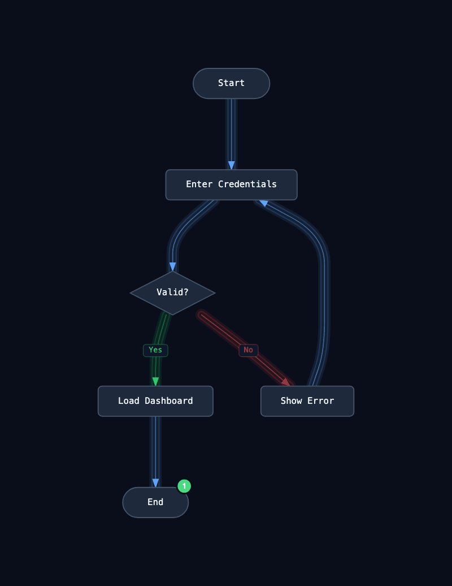
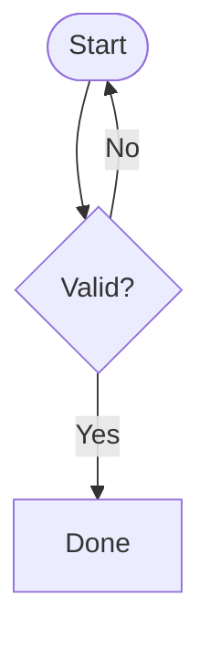

# MermaidFlow Animator

> 🌐 **Languages:** **English** · [Português](README.pt-BR.md)

An interactive visualizer that turns diagrams written in **Mermaid** syntax into real-time animated flows. Boxes become shape-aware nodes, arrows become **pipe-styled** edges, and small **particles** travel through those pipes representing data in motion — like packets in a network or requests in a system.

The application runs 100% in the browser. No backend, no database, no telemetry.

### 🔗 [Try it online: mermaid-flow-animator.pages.dev](https://mermaid-flow-animator.pages.dev/)

Nothing to install — paste your Mermaid diagram, click **Parse & Render**, and play with the particles. Works in any modern browser (Chrome, Firefox, Safari, Edge).

---

## Demo

GIF generated by the application itself via the **EXPORT GIF** button — Login Flow diagram with **success** (green) particles taking the `Yes → Load Dashboard → End` branch and **error** (red) particles taking `No → Show Error → Enter Credentials`:



> This GIF was exported straight from the UI: `Particles=3`, `FPS=15`, `Type=Alternate`. No post-editing — what you see is the live animation captured frame-by-frame by the Web Worker encoder. **Reproduce it yourself at [mermaid-flow-animator.pages.dev](https://mermaid-flow-animator.pages.dev/).**

---

## Table of Contents

- [Demo](#demo)
- [Overview](#overview)
- [Features](#features)
- [Tech Stack](#tech-stack)
- [Project Structure](#project-structure)
- [How It Works](#how-it-works)
  - [1. Parsing Mermaid](#1-parsing-mermaid)
  - [2. Layout with Dagre](#2-layout-with-dagre)
  - [3. SVG Rendering](#3-svg-rendering)
  - [4. Particle Engine](#4-particle-engine)
  - [5. Particle Types (Success / Error)](#5-particle-types-success--error)
  - [6. Loop Detection and Configurable Limit](#6-loop-detection-and-configurable-limit)
  - [7. View Modes (Overview / Follow)](#7-view-modes-overview--follow)
  - [8. iOS-style Notification Badges](#8-ios-style-notification-badges)
- [Cloudflare Pages Deploy](#cloudflare-pages-deploy)
- [Obsidian Plugin](#obsidian-plugin)
- [CLI (`.mmd` → `.gif` / `.mp4`)](#cli-mmd--gif--mp4)
- [Claude / Claude Code skill](#claude--claude-code-skill)
- [Setup & Development](#setup--development)
- [Supported Mermaid Syntax](#supported-mermaid-syntax)
- [Contributing](#contributing)
- [TODO / Roadmap](#todo--roadmap)
- [License](#license)

---

## Overview

You paste a Mermaid-syntax diagram into the editor on the left, click **Parse & Render**, and watch the graph materialize with automatic layout. From there you can:

- Click any node to dispatch a particle that travels through the flow until it reaches a terminal node.
- Configure particles as **Success**, **Error**, or **Alternate** (toggles per spawn).
- Enable **Auto mode** for periodic spawning at the start nodes.
- Switch to **Follow particle**: the camera follows a particle the way Google Maps follows a car, keeping N boxes visible around it (3, 5, 7, or 9).
- See **Success** / **Error** counters updating in the corner, and **iOS-style badges** popping on top of nodes that received particles.

---

## Features

| Category | Details |
|---|---|
| **Mermaid parser** | Supports `flowchart TD/TB/LR/RL/BT`, shapes `[]`, `()`, `([])`, `{}`, `(())`, `[[]]`, edges `-->`, `-->|label|`, `-- text -->`, inline node definitions on edges, `%%` comments, chained syntax `A --> B --> C`. |
| **Layout** | `dagre` computes node positions and smooth Bézier curves for edges. |
| **Pipe edges** | Edges rendered as 4 layers (outer halo, inner channel, dark core, centerline with arrow) — pipe effect through which the particle flows like water. |
| **Particles** | Glow + 6-point fade trail. Speed calibrated to 1 second per edge at 1× (frame-rate independent). |
| **Deterministic path** | Each particle follows **a single path** — at every IF it picks the outgoing edge consistent with its kind. |
| **Success / Error types** | `success` prefers `yes/default` edges, `error` prefers `no/labeled`. In diagrams without an error branch, forces `success` even if the user requested `error`. |
| **Alternate mode** | Automatically flips the kind when the particle re-enters a decision node inside a loop, making it escape via the opposite branch. |
| **Loop detection** | Counts revisits per node. The `success` limit is fixed (4); the `error` limit is configurable via slider (1–10). When a particle hits the limit, it counts as `error` and a badge appears on the IF node where the loop happened. |
| **Follow Particle mode** | The SVG camera follows the oldest active particle, with a 3/5/7/9-box window centered on the current path. Smooth lerp, frame-rate independent. |
| **Pan & Zoom** | Drag to pan, scroll to zoom — manipulating the SVG `viewBox` directly, so **no blur or pixelation** at any zoom level. |
| **iOS-style badges** | Every arrival at a terminal node increments a counter shown as a pill on the top-right corner of the node, with cubic-bezier overshoot pop animation. |
| **SVG export** | Download the rendered diagram as `.svg`. |
| **Built-in examples** | 4 diagrams (Login Flow, Payment Process, CI/CD Pipeline, API Request — in pt and en). |

---

## Tech Stack

- **React 18** + **TypeScript** (strict)
- **Vite 5** (dev server + build)
- **Dagre** + `@types/dagre` (graph layout)
- **Mermaid 11** (only for optional parse validation)
- **Native SVG** (no canvas/graph libraries)
- **Plain CSS** with CSS variables (no Tailwind, MUI, Chakra)
- Fonts: JetBrains Mono + DM Sans (Google Fonts)

No external UI dependencies. No backend. No external state management (just `useState`/`useRef`/`useReducer` when needed).

---

## Project Structure

```
src/
├── components/
│   ├── Editor/
│   │   ├── MermaidEditor.tsx        # Textarea + examples dropdown + Render button
│   │   └── MermaidEditor.css
│   ├── Canvas/
│   │   ├── FlowCanvas.tsx           # SVG container + pan/zoom + follow mode
│   │   ├── EdgeRenderer.tsx         # Edge as 4-layer pipe
│   │   ├── NodeRenderer.tsx         # Node (5 shapes) + iOS badge
│   │   ├── ParticleRenderer.tsx     # Particle with trail and glow
│   │   └── FlowCanvas.css
│   ├── Controls/
│   │   ├── AnimationControls.tsx    # Panel: Play/Speed/Type/Mode/View
│   │   └── AnimationControls.css
│   └── Legend/
│       ├── FlowLegend.tsx           # Pipe and particle colors
│       └── FlowLegend.css
├── hooks/
│   ├── useMermaidParser.ts          # source string → RawGraph (memoized)
│   ├── useGraphLayout.ts            # RawGraph → ParsedGraph via dagre
│   └── useParticleAnimation.ts      # Main animation engine
├── types/
│   └── graph.ts                     # All types (Particle, ParsedGraph, AnimationState…)
├── utils/
│   ├── mermaidParser.ts             # Line-by-line regex parser
│   ├── pathCalculator.ts            # Node dimensions and Bézier curves
│   ├── colorScheme.ts               # Colors + pickEdgeForKind + predictForwardNodes
│   └── particleFactory.ts           # createParticle + flowId counter
├── App.tsx                          # Split editor/canvas layout
├── App.css
├── main.tsx
└── index.css                        # Reset + dark theme + scrollbars
```

---

## How It Works

### 1. Parsing Mermaid

[`src/utils/mermaidParser.ts`](src/utils/mermaidParser.ts) parses manually with line-by-line regex (the `mermaid` library doesn't expose a stable AST):

- Detects the direction (`TD`, `LR`, etc.)
- For each line, identifies inline nodes (`A[Label]`, `B{Decision}`, `C([Stadium])`) and edges (`A --> B`, `A -->|Yes| B`, `A -- text --> B`)
- Supports chained syntax: `A[Start] --> B{Decision} -->|Yes| C[Done]`
- Ignores `subgraph`, `style`, `class`, `linkStyle`, `%%` comments

Output: `RawGraph { nodes, edges, direction }` — without positions yet.

### 2. Layout with Dagre

[`src/hooks/useGraphLayout.ts`](src/hooks/useGraphLayout.ts) uses `dagre.graphlib.Graph` (multigraph) to compute:

- `(x, y)` position for each node
- A sequence of `(x, y)` points describing each edge's path while avoiding collisions
- Node dimensions are computed in [`pathCalculator.ts`](src/utils/pathCalculator.ts) based on shape and label size

Edge points are turned into an SVG path string with smooth **quadratic Bézier curves** between vertices ([`pointsToPath`](src/utils/pathCalculator.ts) in pathCalculator). The result is a `ParsedGraph` ready to render.

### 3. SVG Rendering

[`FlowCanvas.tsx`](src/components/Canvas/FlowCanvas.tsx) mounts a single `<svg>` with 3 layers:

```
<svg viewBox={dynamic}>
  <defs>...</defs>
  <g className="edges-layer">    {/* back */}
    {edges.map(EdgeRenderer)}
  </g>
  <g className="nodes-layer">    {/* middle */}
    {nodes.map(NodeRenderer)}
  </g>
  <g className="particles-layer"> {/* always on top */}
    {particles.map(ParticleRenderer)}
  </g>
</svg>
```

**Edge = 4-layer pipe** ([`EdgeRenderer.tsx`](src/components/Canvas/EdgeRenderer.tsx)):
1. Invisible path with `stroke-width=1` — used for `getTotalLength()` / `getPointAtLength()` in particle math
2. Outer halo (`stroke-width=18`, `opacity=0.10`)
3. Inner channel (`stroke-width=12`, `opacity=0.18`)
4. Dark core (background color, `stroke-width=8`) — creates the "cavity"
5. Centerline (`stroke-width=1.4`) with `markerEnd` arrow

**Pan & Zoom via viewBox**: `{x, y, w, h}` in React state. Wheel adjusts `w/h` around the cursor; drag adjusts `x/y`. Because the browser re-rasterizes natively when the `viewBox` changes, **there is no blur** at any zoom level (unlike `transform: scale()`, which rasterizes once).

### 4. Particle Engine

[`src/hooks/useParticleAnimation.ts`](src/hooks/useParticleAnimation.ts) is the heart of the animation. A single `requestAnimationFrame` loop, scheduled **outside** the `setState` updater (important to avoid duplication under React 18 StrictMode).

Every frame:

1. Computes real `dt` via `performance.now()` — animation independent of framerate.
2. For each active particle:
   - Reads the corresponding SVG `<path>` via `pathElementsRef` (registered by `EdgeRenderer`).
   - Advances `progress` by `particle.speed * dt` (where `speed = 1 × multiplier` means "1 edge per second").
   - Computes the `(x, y)` position with `pathEl.getPointAtLength(progress * totalLength)`.
   - Updates the trail: prepends the old point, fades subsequent points.
3. When a particle reaches `progress >= 1` (arrived at the target node):
   - If the target node has no outgoing edges → counts as a `success`/`error` completion + increments arrival on the node.
   - Otherwise → picks **one** outgoing edge via `pickEdgeForKind` and creates a new particle inheriting `flowId` and `visitedNodes + targetNodeId`.

The engine uses `particlesRef` as the source of truth and only calls `setParticles` to notify React. This avoids `setState` updaters duplicating side effects.

### 5. Particle Types (Success / Error)

Each particle carries a `kind: 'success' | 'error'` that determines:

- **The color**: bright green (`#4ade80`) or bright red (`#f87171`) — defined in [`PARTICLE_COLORS`](src/utils/colorScheme.ts).
- **The branch choice**: [`pickEdgeForKind`](src/utils/colorScheme.ts) has priority orders:
  - `success`: `yes` → `default` → `labeled` → `no`
  - `error`: `no` → `labeled` → `default` → `yes`

The user picks via **PARTICLE TYPE** in the panel: `Success`, `Error`, or `Alternate` (interleaving). In Alternate mode, when the particle **re-enters** a decision node during a loop, the kind is flipped — making it escape via the opposite side.

There's a coherence check: [`hasErrorBranchDownstream`](src/utils/colorScheme.ts) simulates the path forward comparing the `success` and `error` choices. If they never diverge, no error is possible, and the particle is forced to `success` even if the user asked for `error`.

### 6. Loop Detection and Configurable Limit

The engine **does not** use a depth counter — that broke on long linear paths. Instead, it counts **how many times the next edge's target node already appears in `visitedNodes`**:

```ts
const targetVisitCount = particle.visitedNodes.filter(n => n === chosen.target).length;
const limit = nextKind === 'error' ? errorLoopLimitRef.current : MAX_LOOP_ITERATIONS;
if (targetVisitCount < limit) { /* spawn */ } else { /* loop limit hit */ }
```

- `MAX_LOOP_ITERATIONS = 4` for success (constant)
- `errorLoopLimit` for error: **configurable via slider 1–10** in the panel

When the limit is hit in pure Error mode:
- Increments `errorCompleted` (top-left corner).
- Adds an arrival to the **most recent IF** in the path (searches `visitedNodes` for the node with `outgoing.length > 1`) → badge appears over it.

### 7. View Modes (Overview / Follow)

**Overview** (default): viewBox covers the entire graph with padding. Manual pan/zoom enabled.

**Follow particle**: the camera follows the particle with the smallest `flowId` still active (the "oldest"). Each particle has:
- `flowId` (shared by every particle that descends from the same click).
- `visitedNodes` (path traversed so far).

For the N-box window:
- `ceil(N/2)` boxes behind (from `visitedNodes`)
- `floor(N/2)` boxes ahead (predicted by [`predictForwardNodes`](src/utils/colorScheme.ts), which simulates `pickEdgeForKind` forward)

Each frame in Follow:
1. Computes the bounding box of the N nodes + the particle position
2. Computes the ideal `viewBox` (78% occupancy, wrapper aspect ratio)
3. Lerps the current viewBox toward the target with factor `1 - exp(-k·dt)` (smooth, frame-rate independent)

The followed particle gets a highlight ring + larger glow via the SVG `followed-glow` filter.

### 8. iOS-style Notification Badges

[`NodeRenderer.tsx`](src/components/Canvas/NodeRenderer.tsx) renders an SVG pill in the top-right corner of every node with arrivals:

- Red if it only received `error`, green if only `success`; if both are present, two pills are rendered side-by-side (success on the left, error in the corner).
- White text, `99+` for high totals.
- `badge-pop` animation (cubic-bezier with overshoot) re-triggered on every increment via `key={count}`.
- Position adapts to the shape (top-right corner for rectangles, right vertex for diamonds, 45° arc for circles).

Structured as **two nested `<g>` elements**: the outer one does `translate(cx, cy)` (fixed), the inner one runs the CSS `scale + opacity` animation — so the badge doesn't "fly" from the node origin to its final spot during the pop.

---

## Cloudflare Pages Deploy

The public version runs on **[mermaid-flow-animator.pages.dev](https://mermaid-flow-animator.pages.dev/)**, hosted for free on Cloudflare Pages with continuous deployment from `main`. Each push triggers a new build in ~30 seconds.

The application includes a [`wrangler.toml`](wrangler.toml) at the project root. Cloudflare Pages auto-detects this file and uses its configuration.

### Dashboard configuration

When connecting the repository to Cloudflare Pages, make sure of:

| Field | Value |
|---|---|
| **Framework preset** | None (or `Vite`) |
| **Build command** | `npm run build` |
| **Build output directory** | `dist` |
| **Root directory** | _(empty — uses repo root)_ |
| **Node version** | `18` or higher (default `22.x` works fine) |

`wrangler.toml` reinforces the `Build output directory` via `pages_build_output_dir = "./dist"` — if there's a divergence between the dashboard and the file, the file wins.

### Auxiliary files in `public/`

- [`public/_redirects`](public/_redirects) — SPA fallback `/* → /index.html 200`. If you add client-side routing in the future (hash or pathname router), refresh on any route keeps working instead of returning 404.
- [`public/_headers`](public/_headers) — `Cache-Control: immutable` for Vite's hashed assets (max-age 1 year) + security headers (`X-Content-Type-Options: nosniff`, `Referrer-Policy: strict-origin-when-cross-origin`).

Vite copies everything from `public/` into `dist/` at build time, so these files are automatically served by Cloudflare.

### Troubleshooting

- **HTTP 500 on every route, including non-existent paths** → Cloudflare's serving infrastructure is in an inconsistent state. Go to the project dashboard → Deployments → "Retry deployment" on the latest deploy. If it persists, delete and recreate the project pointing to the same repository.
- **404 on refresh of any route** → make sure `public/_redirects` was copied to `dist/` (it should appear in Cloudflare's build log as an uploaded file).
- **Build fails with `Cannot find module 'gif.js'`** → ensure `npm install` runs before the build. Cloudflare does this automatically via `npm clean-install`, but if your `package-lock.json` is stale, regenerate with `npm install`.
- **Assets load but the app stays blank** → open DevTools, Console tab. Likely a specific JavaScript error. The bundle has hashed filenames, so old browser cache won't cause this issue.

---

## Obsidian Plugin

There is also an **official plugin for [Obsidian](https://obsidian.md/)** that renders animated diagrams inline inside your notes. Same engine (parser, layout, particles), but without React — a ~105 KB bundle with imperative DOM/SVG rendering via `MarkdownRenderChild`.

### Usage inside Obsidian

````markdown

````

Everything is set up in [`plugin/`](plugin/) — a self-contained folder with `manifest.json`, `package.json`, GitHub Actions release workflow, and copies of the core utilities. See [plugin/README.md](plugin/README.md) for manual install instructions and Obsidian Community Plugins submission steps.

### Publishing

To publish on the official Obsidian community list, the plugin must live in a **dedicated repository**. The recommended path is to extract `plugin/` into a separate repo:

```bash
git subtree split --prefix plugin -b plugin-only
git push <new-repo-url> plugin-only:main
```

Then push the first tag (the [GitHub Action](plugin/.github/workflows/release.yml) builds and creates the release with assets), and open a PR on [obsidianmd/obsidian-releases](https://github.com/obsidianmd/obsidian-releases) with the plugin entry. Full details in [plugin/README.md](plugin/README.md#submission-to-the-obsidian-community-plugins-listing).

---

## CLI (`.mmd` → `.gif` / `.mp4`)

Need a `.mmd` file rendered as an animated `.gif` or `.mp4` straight from the terminal? The [`cli/`](cli/) folder contains a Node CLI that drives the web app via headless Chromium and pipes the captured frames through `ffmpeg`.

```bash
# One-time setup
npm run build              # builds the web app the CLI drives
cd cli
npm install
npx playwright install chromium
npm run build

# Render a diagram
./dist/index.js examples/login-flow.mmd -o login.gif --duration 6 --fps 15
./dist/index.js examples/login-flow.mmd -o login.mp4 --duration 8 --type alternate
```

Reuses 100% of the rendering logic in the web app (parser, dagre layout, particle engine, pipe styling). Configurable via flags for type, speed, duration, FPS, dimensions, scale, badges visibility, and more. Two-pass GIF encoding with `palettegen` for crisp colors; `libx264 + yuv420p + faststart` for MP4 compatibility everywhere.

Full documentation, examples, and troubleshooting in [cli/README.md](cli/README.md).

A `bin/mermaid-flow` wrapper resolves the CLI from anywhere — symlink it once into `$PATH`:

```bash
ln -s "$(pwd -P)/bin/mermaid-flow" /usr/local/bin/mermaid-flow

# Now from any directory:
mermaid-flow flow.mmd -o out.gif
```

---

## Claude / Claude Code skill

A ready-to-use skill lives at [`.claude/skills/mermaid-flow/`](.claude/skills/mermaid-flow/). Once installed, Claude (Sonnet/Opus in Claude Code) auto-detects when a user wants to render a Mermaid flowchart as an animated GIF/MP4 and drives the CLI for them — handling format choice, sensible defaults per use case (README vs slide deck vs social), and validating the output.

### Install for global use

```bash
# Symlink the skill into your user-level Claude config
mkdir -p ~/.claude/skills
ln -s "$(pwd -P)/.claude/skills/mermaid-flow" ~/.claude/skills/mermaid-flow

# Make sure the CLI wrapper is in PATH (or set MERMAID_FLOW_DIR)
ln -s "$(pwd -P)/bin/mermaid-flow" /usr/local/bin/mermaid-flow
```

After that, in any Claude Code session you can say things like *"render this flow as an MP4 for my slides"* or *"make a GIF of this .mmd"* and Claude will run the CLI with appropriate flags. The skill description is structured so Claude only triggers on flowchart-animation intent, not on static Mermaid rendering or non-flowchart diagrams.

### What the skill does

- Validates the input is a `flowchart` (rejects sequence/gantt/pie diagrams)
- Picks GIF vs MP4 based on use case heuristics (slides → MP4, README → GIF)
- Resolves the CLI binary across `$PATH`, `MERMAID_FLOW_DIR`, or asks the user
- Walks through a decision tree for `--duration`, `--fps`, `--width/--height`, `--type`
- Verifies output via `file <path>` after the run
- Translates common errors (Playwright not installed, `dist/` not built) into actionable user messages

The full skill spec is at [`.claude/skills/mermaid-flow/SKILL.md`](.claude/skills/mermaid-flow/SKILL.md).

---

## Setup & Development

### Prerequisites

- Node.js 18+
- npm 9+

### Commands

```bash
# Install dependencies
npm install

# Dev server (hot reload)
npm run dev
# → http://localhost:5173

# Type check (no emit)
npm run typecheck

# Production build
npm run build
# → dist/ (~85kb gzipped)

# Preview the production build locally
npm run preview
```

### Editor shortcuts

- `⌘ Enter` (or `Ctrl Enter`): triggers Parse & Render
- `Tab`: inserts 2 spaces (instead of moving focus)

---

## Supported Mermaid Syntax

**Graph direction:**

```text
flowchart TD    %% Top-Down (also: TB)
flowchart BT    %% Bottom-Top
flowchart LR    %% Left-Right
flowchart RL    %% Right-Left
```

**Node shapes:**

```text
A[Rectangle]
B(Stadium)
C([Stadium with brackets])
D{Diamond / decision}
E((Circle))
F[[Subroutine]]
```

**Edge types:**

```text
A --> B                  // default
A -->|Label| B           // pipe-label
A -- text --> B          // text-label
A --> B --> C            // chained
```

**Inline definitions on edges** (the node is registered as it appears):

```text
X[Start] --> Y{Valid?} -->|Yes| Z[Done]
```

**Comments** start with `%%` on their own line.

**Full renderable example:**


**Not supported (yet):** subgraphs, classes/styles, click handlers, non-flowchart graphs (sequence, gantt, pie, etc.).

---

## Contributing

Contributions are very welcome! Here's the process:

### 1. Setup

```bash
git clone <repo-url>
cd mermaid-Visualizer
npm install
npm run dev
```

### 2. Workflow

1. Branch off `main`: `git checkout -b feat/my-feature`
2. Make your changes. Keep:
   - **Strict TypeScript** — no unjustified `any`, prefer explicit types
   - **No new UI libs** — plain CSS is the house style
   - **No comments narrating the obvious** — readable code is the goal
3. Run `npm run typecheck` and `npm run build` to make sure nothing broke
4. Manually test with at least 2 of the built-in examples (Login Flow and Payment Process cover decisions and loops)
5. Commit with a descriptive message: `feat: add subgraph support` / `fix: badge wasn't showing on tall diamonds`
6. Open a PR describing: what, why, and how you tested

### 3. Areas where help is especially welcome

- **Parser**: extend Mermaid syntax coverage (subgraphs, class links, etc.)
- **Layout**: alternatives to dagre (ELK, custom force-directed)
- **Accessibility**: keyboard navigation, screen reader support
- **Performance**: optimize the particle loop for 1000+ simultaneous particles
- **Testing**: unit test coverage (Vitest) — the project currently has no test suite
- **Documentation**: more screenshots, GIFs, additional language translations

### 4. Code style

- 2-space indentation
- `'single quotes'` for strings, `` `template strings` `` when useful
- Components in PascalCase, hooks prefixed with `use`
- `.tsx` files for React components, `.ts` for pure logic
- CSS always in a separate file co-located with the component

### 5. Reporting bugs

Include in the issue:
- The Mermaid diagram used (paste the source)
- Expected vs. observed behavior
- Browser and OS
- Screenshot or screen recording if possible

---

## TODO / Roadmap

Ideas and planned improvements — feel free to pick one and open a PR.

### 🎨 UX / Visual

- [ ] **Light theme** — toggle between dark and light with `localStorage` persistence
- [ ] **Color customization** — panel for the user to choose pipe/particle colors
- [ ] **Editor with real syntax highlighting** (e.g. Monaco / CodeMirror instead of `<textarea>`)
- [ ] **Minimap** in the bottom corner of the canvas while in Overview mode
- [ ] **Tooltip** on hover showing the list of particles that arrived (with their `flowId`, kind, timestamp)
- [ ] **Persistent edge trails** that build up as particles pass through, forming a visual "heatmap"
- [ ] **Spawn animation** — particle appears with a splash effect when created
- [ ] **Optional sounds** — audible pulse when a particle reaches a terminal node (UI toggle)

### 🔧 Features

- [ ] **Subgraphs** in the parser (`subgraph X ... end`)
- [ ] **Persistence** — save the current diagram to `localStorage` / `URL hash` for sharing
- [ ] **JSON import/export** of the parsed graph
- [ ] **Click on a badge to clear** that node's counter (iOS-swipe style)
- [ ] **Pause an individual particle** by clicking on it
- [ ] **Inspect particle** — clicking opens a panel with its visitedNodes history, kind, age, etc.
- [ ] **Keyboard controls** — spacebar (play/pause), `r` (reset), `f` (fit), `1-9` (speed)
- [ ] **Undo/Redo** for editor changes
- [ ] **Multiple diagrams in tabs** simultaneously
- [ ] **Diff between diagrams** — visualize differences between two flow versions

### ⚡ Engine

- [ ] **Per-edge probabilities** — instead of rigid priorities, support `-->|0.7| ...` for 70% chance
- [ ] **Variable per-edge speed** — slower edges to represent bottlenecks
- [ ] **Particles with payloads** — each particle carries an optional ID/data visible on inspection
- [ ] **Benchmark mode** — generate 10k particles, measure FPS and per-phase timing
- [ ] **Web Worker** for parser/layout on very large diagrams (1000+ nodes)
- [ ] **Deadlock detection** — highlight nodes where particles get stuck indefinitely
- [ ] **Replay mode** — record a particle session and play it back later

### 🧪 Quality

- [ ] **Vitest** + unit test suite for `mermaidParser`, `pickEdgeForKind`, `predictForwardNodes`
- [ ] **E2E tests** with Playwright covering the main flows
- [ ] **CI** on GitHub Actions: typecheck + build + test on PRs
- [ ] **ESLint + Prettier** with shared configuration
- [ ] **Storybook** for isolated Canvas components

### 📚 Documentation

- [x] ~~Translate the README to English~~ ← done
- [ ] **Screenshots and GIFs** for each main feature
- [ ] **Interactive examples page** with 10+ diagrams
- [ ] **Video tutorial** walking through parse → animation → follow
- [ ] **Architecture decision records (ADRs)** explaining technical choices (regex parser, viewBox-based zoom, alternate flip on revisit)

### 🌐 Integrations

- [ ] **Embed mode** — minimalist iframe to include animated diagrams in other pages
- [ ] **GitHub Action** that renders a README diagram as an animated GIF and auto-commits
- [ ] **VSCode plugin** that opens the visualizer from `mermaid` blocks in `.md` files
- [x] ~~**CLI** that takes a `.mmd` file and generates an animation as `.mp4` or GIF~~ ← done, see [cli/](cli/)

### 📱 Mobile / Responsive

- [ ] Vertical layout optimized for mobile (editor on top, canvas below, panel as drawer)
- [ ] Touch gestures — pinch zoom, two-finger pan, tap to dispatch a particle
- [ ] PWA with service worker for offline use

---

## License

MIT — see [LICENSE](LICENSE) (to be added).

---

Built with care and native SVG. No UI framework, no analytics, no tracking. You paste, you watch it flow, you close the tab.
